<div align="center">

<table>
<tr>
<td valign="top"></td>
<td valign="top"></td>
</tr>
</table>



</div>

---

```console
sevbanarkn@github:~$ whoami
Full-stack developer. .NET and C# on the back, React + TypeScript + Vite on the front.
ERP, logistics and workflow systems at Barlas Lojistik.

sevbanarkn@github:~$ ls ~/interests
api-design/   clean-architecture/   sql-tuning/   react-ui/   automation/

sevbanarkn@github:~$ cat ~/.contact
github  https://github.com/sevbanarkn
```

<sub>Every panel above is a self-contained animated SVG, generated by
<a href="scripts/">Python</a> and refreshed daily by
<a href=".github/workflows/update-readme.yml">GitHub Actions</a>.
See <a href="SETUP.md">SETUP.md</a>.</sub>
